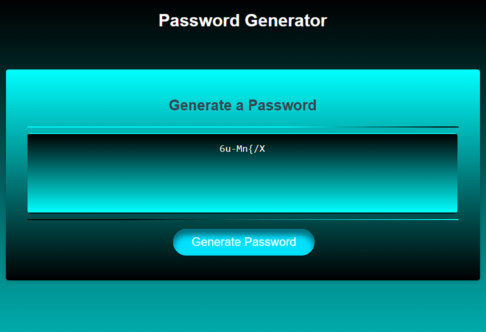

# Password Generator
## Description

Provide a short description explaining the what, why, and how of your project. Use the following questions as a guide:

I wanted to make an easy-to-use password generator that is neatly styled. I also wanted the user to be able to easily choose whether
they would like uppercase letters, lowercase letters, numbers, or symbols in their generated password. Upon visiting the site, one 
can quickly generate a password for use on any account. They are prompted to choose the parameters of their password, and each decision
is repeated back to the user so they can verify their choices. Instead of coming up with a different unique password on the fly every time
you have to create a pesky new account, you can simply let the program do the work for you! Working on this project really helped me solidify
how to use objects in javascript, and how to call the script from html.

## Table of Contents (Optional)

- [Usage](#usage)
- [Credits](#credits)
- [License](#license)
- [Features](#features)

## Usage

Simply head over to the page at this link, bookmark it, and any time you need a new password navigate to the bookmark. ---> [Password Generator](https://ikonicres.github.io/Password-Generator/)  
The page is easy to use: When ready to generate a new password, press the "Generate" button at the bottom-center, and answer the series of criteria prompts
that pop up. Make sure to choose a number between 8 and 128, otherwise the program will chide you for breaking the parameters. After that, choose whether
you would like any of the following: Uppercase letters, Lowercase letters, Numbers, and Symbols by pressing "Ok" to confirm, and "Cancel" to exclude.
Make sure to include at least one type of character, otherwise you will be met with an "Error" Alert. When all choices have been confirmed, the program
will generate the password with requested criteria and display it to the textbox in the center. Have fun, enjoy, and stay secure!  

## Credits

This was actually a fun little brainteaser that I enjoyed doing alone for the most part. Definitely thanks as always to the class and TA's

## License

The MIT License (MIT)

Copyright (c) 2023 Michael Ikonomou

Permission is hereby granted, free of charge, to any person obtaining a copy of this software and associated documentation files (the "Software"), to deal in the Software without restriction, including without limitation the rights to use, copy, modify, merge, publish, distribute, sublicense, and/or sell copies of the Software, and to permit persons to whom the Software is furnished to do so, subject to the following conditions:

The above copyright notice and this permission notice shall be included in all copies or substantial portions of the Software.

THE SOFTWARE IS PROVIDED "AS IS", WITHOUT WARRANTY OF ANY KIND, EXPRESS OR IMPLIED, INCLUDING BUT NOT LIMITED TO THE WARRANTIES OF MERCHANTABILITY, FITNESS FOR A PARTICULAR PURPOSE AND NONINFRINGEMENT. IN NO EVENT SHALL THE AUTHORS OR COPYRIGHT HOLDERS BE LIABLE FOR ANY CLAIM, DAMAGES OR OTHER LIABILITY, WHETHER IN AN ACTION OF CONTRACT, TORT OR OTHERWISE, ARISING FROM, OUT OF OR IN CONNECTION WITH THE SOFTWARE OR THE USE OR OTHER DEALINGS IN THE SOFTWARE.

## Features

This program can make any type of password from 8-128 characters. It has exception handling for if the user enters an invalid or impossible set of parameters, and displays the text in the textbox in the middle for you to copy easily.
